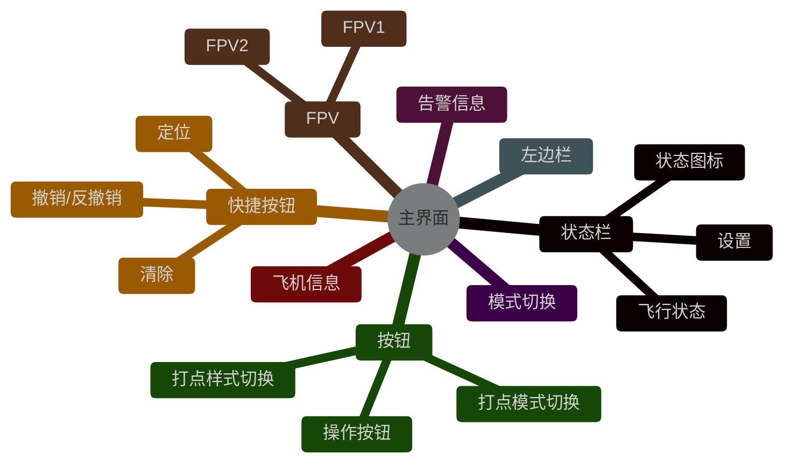
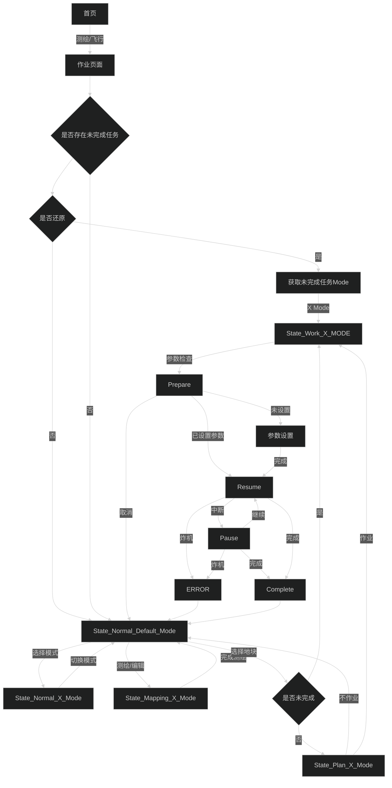

# 预览图

![[Pasted image 20231129163415.png]]
# 思维导图

# 模式

- 全自主
- 果树
- AB点
- 大田
# 功能依赖拆分
## 状态栏

|功能|依赖|
|--|--|
|告警信息|==告警模块==|
|飞机信息|==任务模块== ==飞机模块==|
|状态图标|==飞机模块==|

> [!NOTE] 无依赖
> 所有功能内部集成依赖模块即可

## 模式切换

|功能|依赖|
|--|--|
|模式显示|==状态机模式==|

> [!WARNING] 有依赖
> 依赖状态机状态改变显示内容，并会去修改状态机
> 单一功能

## 告警

|功能|依赖|
|--|--|
|告警信息|==告警模块==|

> [!NOTE] 无依赖
> 仅负责和告警模块交互，所有功能内聚

## 左边栏

|功能|依赖|
|--|--|
|内容填充|==作业模式==|

> [!ERROR] 完全依赖
> 本质作为作业模式功能扩充，属于作业模式的延伸
> 内部功能与模式强绑定

## FPV

|功能|依赖|
|--|--|
|个数|==依赖硬件==|

> [!NOTE] 无依赖
> 与飞机硬件强相关

## 飞机信息

|功能|依赖|
|-|-|
|飞机数据展示|==飞机模块==|

> [!NOTE] 无依赖
> 仅作为飞机信息的载体

## 快捷按钮

|功能|依赖|
|-|-|
|状态控制| ==作业模式==|
|按钮显示|==作业模式==|

> [!ERROR] 完全依赖
> 操作交互与作业模式强绑定

## 按钮

|功能|依赖|
|-|-|
|交互/显示|==作业模式==|

> [!ERROR] 完全依赖
> 操作交互与作业模式强绑定

# 流程图

