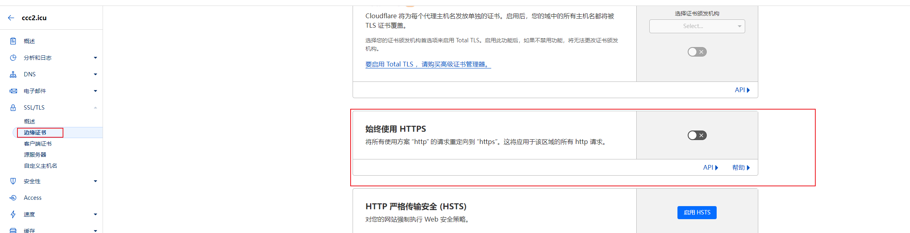
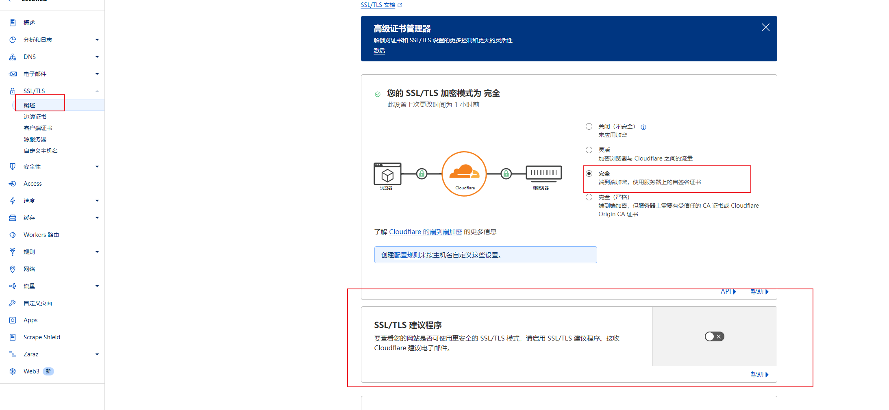

# github pages加速

国内访问githubpages速度过慢
国内主流云服务商不再提供免费cdn加速，改用cloudflare进行加速

# CloudFlare
::: info 介绍
CloudFlare 是国外免费的cdn加速服务商，没有被墙，速度还行

https://www.cloudflare-cn.com/
:::
## 修改dns解析

这里使用的阿里云：域名 -> 管理 -> 修改DNS 即可将默认DNS修改为CloudFlare的DNS

## 关闭强制HTTPS

这里需要吧https给关闭，因为在github上面已经默认配置了https，这里开启会存在别的问题

## 使用完全加密

关闭ssl建议，开启完全加密
这里使用github的自签名证书，不需要使用cf的证书
开启完全加密是为了确保每次都走cf的路由
否则会出现http转https又转回http的无限重定向问题
::: danger
ERR_TOO_MANY_REDIRECTS
:::

## 适当开启dns解析

这里除了githubpages是海外服务器外，其余都是国内服务器，无需再走一遍cf加速，只让github使用cdn转发