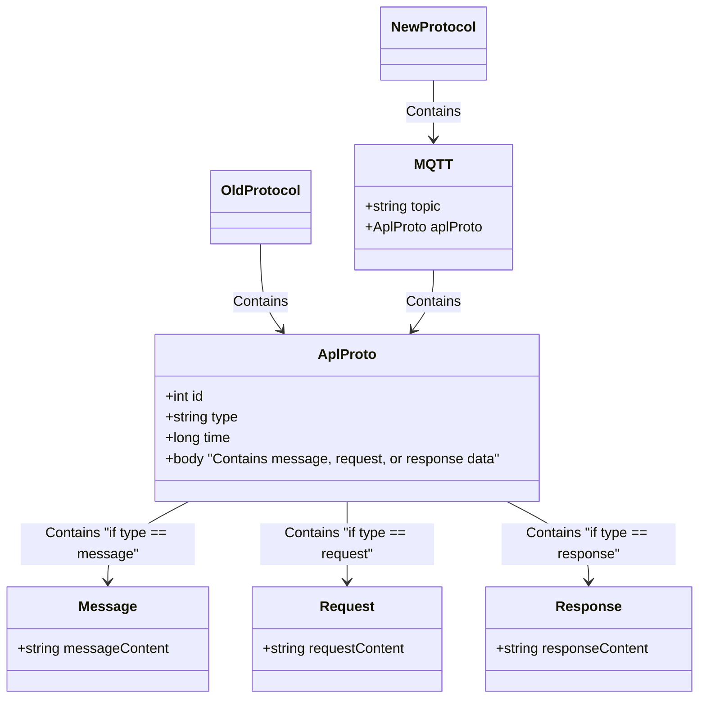

## 无人机消息关系


## 基础结构体

分为 MQTT 数据体，和包装在 MQTT 内部的，原始的 PB 数据

根据业务需求，可能会扩充 MQTT 携带的字段，以及 PB 内部的 Body 数据。

=== "MQTT"
	
	```mqtt
	Topic: "topic"
	Body: {
		pb: AplProto, // 消息主体就是原本的pb数据体
	}
	```

=== "pb"

	```protobuf
	AplProto {
		id: 0, // 自增 id,新增字段，以确保多链路数据去重与排序
		type: Workrequest/Workresponse/WorkMessage; // 消息类型
		time:1736901269952, // 时间戳，表示发送时间
		body: byteData; // 根据消息类型，传入对应的数据结构 
	}
	```

## 遥测数据

=== "MQTT"

	`Topic` 定制，接收指定无人机的遥测，格式如下
	
	`/t/a/{apl_id}/from_apl_q0` 
	
	这里最后的`q0`指代 MQTT 中的 `QoS0`类型，遥测消息有多个接收方，不要求接收方必须收到且给到回复，故使用优先级最低的 `QoS0`。

	```mqtt
	Topic: "/t/a/{apl_id}/from_apl_q0"
	Body: {
		pb: AplProto, // 消息主体就是原本的pb数据体
	}
	```

=== "pb"

	消息类型在遥测场景下固定为`WorkMessage`

	```ProtoBuf
	AplProto {
		id: 0, // 自增 id,新增字段，以确保多链路数据去重与排序
		type: WorkMessage; // 消息类型
		time:1736901269952, // 时间戳，表示发送时间
		body: byteData; // 根据消息类型，传入对应的数据结构 
	}
	```

=== "WorkMessage"

	这里内部的数据和当前线上版本的内容一致，不做调整

	```ProtoBuf
	// Apollo执行工作中的状态数据
	message WorkMessage
	{
	    string topic = 1; //消息主题
	    string protocal_version = 2; //协议版本号
	    bytes body = 3; //消息内容，格式有应用确定
	}
	```

## 请求类消息

=== "MQTT"

	这里的消息应当使用`QoS1`的类型，因为需要确保发送的消息能够正确送达，但是因为同时存在云端和无人机两种来源，则原本`QoS2`的类型本身就变得不可靠，并且`QoS2`的消息对 Broker 的性能也会造成浪费
	
	`Topic` 定制，根据接收方的不同，有以下2种格式
	
	接收方为无人机：`/t/i/{apl_id}/to_apl_q1`
	
	接收方为App：`/t/tia/{apl_id}/to_app_q1`
	
	后续可能存在更多的类型，那么可以继续扩充，对应 Client 只需要关注发送给自己的消息即可

	```mqtt
	Topic: /t/a/{apl_id}/from_apl_q0 / /t/tia/{apl_id}/to_app_q1
	Body: {
		pb: AplProto, // 消息主体就是原本的pb数据体
	}
	```

=== "pb"

	消息类型在发送命令/请求场景下固定为`WorkRequest`

	```ProtoBuf
	AplProto {
		id: 0, // 自增 id,新增字段，以确保多链路数据去重与排序
		type: WorkRequest; // 消息类型
		time:1736901269952, // 时间戳，表示发送时间
		body: byteData; // 根据消息类型，传入对应的数据结构 
		String responseId = uniqueId // topic for response
	}
	```

=== "WorkRequest"

	这里内部的数据和当前线上版本的内容一致，不做调整

	```ProtoBuf
	// Apollo执行工作中的状态数据
	message WorkRequest
	{
    string cmd = 1; //命令
    uint32 id = 2;  //命令惟一标识
    uint32 delay = 3 ; //是否延迟执行 ms
    uint32 times = 4 ; //执行次数
    uint32 interval = 5 ; //执行间隔 ms  
    string protocal_version = 6; //协议版本号
    bytes args = 7; //命令参数, 具体结构有应用去约定，转成字节码后存放此处 
	}
	```

## 响应类消息

消息统一使用`QoS1`等级，原因和 Request 一样，在当前环境下，`QoS2` 不再可靠且会造成额外的性能浪费。

MQTT 的响应方式待讨论

- 方案1：固定 Topic，按照预设的 Topic 进行监听。（现有的Apollo和服务器的交互方式）
- 方案2：随机 Topic，该 Topic 由 Request 携带，Response 发布的 Topic 使用该 Topic。

=== "MQTT 固定 Topic"

	固定 Topic：
	
	- /t/a/{apl_id}/from_apl_q1
	- /t/tia/{apl_id}/from_app_q1
	
	该方式是当前 Apollo 和服务器的交互方式，但是存在以下问题需要讨论：
	
	1. 响应使用的是遥测相同 Topic，仅仅是`QoS`等级不同，那么该 Topic 会混合遥测业务逻辑在里面（无法保证有没有部分遥测会走Q1，在概念上他们都属于同一个 Topic），并且要处理所有来自发送方的数据，即使某些 Request 不是自己发送的，也需要处理对应的 Response 信息。
	2. 响应来自各个方面，在当前存在4种源，RC，移动设备，无人机，服务器。也就是要同时监听多端数据，并且走相同的处理逻辑，会对业务逻辑造成影响，或者不必要的浪费。
	
	```mqtt
	Topic: /t/a/{apl_id}/from_apl_q1 / /t/tia/{apl_id}/from_app_q1
	Body: {
		pb: AplProto, // 消息主体就是原本的pb数据体
	}
	```
	
=== "MQTT 随机 Topic"
	
	随机 Topic 指的是在发送请求的时候，生成一个随机唯一 id，回复时发布该 id 命名的 Topic，请求方在发布前监听该 Topic，并在接收到消息或超时后取消监听。
	
	该方式优势在于可以精准匹配回复消息，且回复类型的消息不会对不关注该消息的客户端产生影响。
	但是该方式存在以下问题：
	
	1. 随机 id 可能会对后续的问题排查存在干扰
	2. 该方式是否对apollo的架构存在影响，对老版本的兼容性如何
	
	```mqtt
	Topic: id from request
	Body: {
		pb: AplProto, // 消息主体就是原本的pb数据体
	}
	```
	
=== "pb"

	消息类型在发送命令/请求场景下固定为`Workresponse`

	```ProtoBuf
	AplProto {
		id: 0, // 自增 id,新增字段，以确保多链路数据去重与排序
		type: WorkRequest; // 消息类型
		time:1736901269952, // 时间戳，表示发送时间
		body: byteData; // 根据消息类型，传入对应的数据结构 
	}
	```

=== "Workresponse"

	这里内部的数据和当前线上版本的内容一致，不做调整

	```ProtoBuf
	// Apollo执行工作后的结果
	message WorkResponse
	{
	    string cmd = 1; //执行的命令
	    uint32 id = 2;  //命令惟一标识
	    uint32 times = 3 ;//第几次执行
	    uint32 status_code = 4;//命令执行状态码
	    bytes result  = 5; //应用具体的运行结果，转成字节码后存放此处
	}

	```

## 其它类消息

### 心跳

```protobuf
message Heartbeat {
  enum Type {
      RC,
      Drone,
      Mobile
      ...
  }
  Type type = 1;
  string indentify = 2; // 
  int priority = 3; // 设备的优先级，对于 无人机无意义，默认是0，RC根据主/副控来决定
  enum Capacity {
      NONE = 0，
      MONITOR = 1,
      AUTO_DRIVER = 2,
      MANUAL_DRIVER = 4，
  }
  int capacity = 4;  // 该设备的能力  -  是否需要
}
```

### `P0`激活状态

