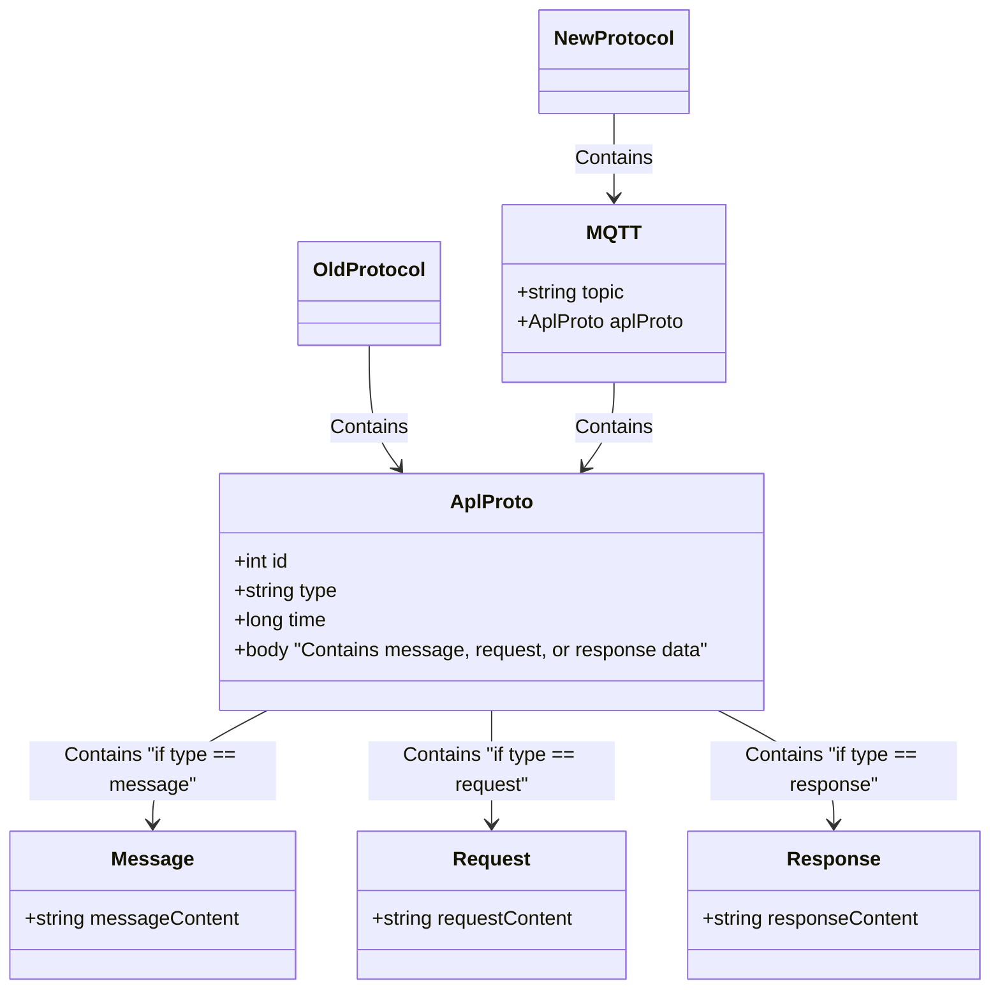

## 无人机消息关系


## 基础结构体

分为 MQTT 数据体，和包装在 MQTT 内部的，原始的 PB 数据

根据业务需求，可能会扩充 MQTT 携带的字段，以及 PB 内部的 Body 数据。

=== "MQTT"
	
	```mqtt
	Topic: "topic"
	Body: {
		pb: AplProto, // 消息主体就是原本的pb数据体
	}
	```

=== "pb"

	```protobuf
	AplProto {
		id: 0, // 自增 id,新增字段，以确保多链路数据去重与排序
		type: Workrequest/Workresponse/WorkMessage; // 消息类型
		time:1736901269952, // 时间戳，表示发送时间
		body: byteData; // 根据消息类型，传入对应的数据结构 
	}
	```

## 遥测数据

=== "MQTT"

	`Topic` 定制，接收指定无人机的遥测，格式如下
	
	`/t/a/{apl_id}/from_apl_q0` 
	
	这里最后的`q0`指代 MQTT 中的 `QoS0`类型，遥测消息有多个接收方，不要求接收方必须收到且给到回复，故使用优先级最低的 `QoS0`。

	```mqtt
	Topic: "/t/a/{apl_id}/from_apl_q0"
	Body: {
		pb: AplProto, // 消息主体就是原本的pb数据体
	}
	```

=== "pb"

	消息类型在遥测场景下固定为`WorkMessage`

	```ProtoBuf
	AplProto {
		id: 0, // 自增 id,新增字段，以确保多链路数据去重与排序
		type: WorkMessage; // 消息类型
		time:1736901269952, // 时间戳，表示发送时间
		body: byteData; // 根据消息类型，传入对应的数据结构 
	}
	```

=== "WorkMessage"

	这里内部的数据和当前线上版本的内容一致，不做调整

	```ProtoBuf
	// Apollo执行工作中的状态数据
	message WorkMessage
	{
	    string topic = 1; //消息主题
	    string protocal_version = 2; //协议版本号
	    bytes body = 3; //消息内容，格式有应用确定
	}
	```

## 请求类消息

=== "MQTT"

	这里的消息应当使用`QoS1`的类型，因为需要确保发送的消息能够正确送达，但是因为同时存在云端和无人机两种来源，则原本`QoS2`的类型本身就变得不可靠，并且`QoS2`的消息对 Broker 的性能也会造成浪费
	`Topic` 定制，根据接收方的不同，有以下2种格式
	接收方为无人机：`/t/tia/{apl_id}/to_app_q2`
	接收方为App：`/t/tia/{apl_id}/to_app_q1`
	后续可能存在更多的类型，那么可以继续扩充，对应 Client 只需要关注发送给自己的消息即可

	```mqtt
	Topic: "/t/a/{apl_id}/from_apl_q0"
	Body: {
		pb: AplProto, // 消息主体就是原本的pb数据体
	}
	```

=== "pb"

	消息类型在遥测场景下固定为`WorkMessage`

	```ProtoBuf
	AplProto {
		id: 0, // 自增 id,新增字段，以确保多链路数据去重与排序
		type: WorkMessage; // 消息类型
		time:1736901269952, // 时间戳，表示发送时间
		body: byteData; // 根据消息类型，传入对应的数据结构 
	}
	```

=== "WorkMessage"

	这里内部的数据和当前线上版本的内容一致，不做调整

	```ProtoBuf
	// Apollo执行工作中的状态数据
	message WorkMessage
	{
	    string topic = 1; //消息主题
	    string protocal_version = 2; //协议版本号
	    bytes body = 3; //消息内容，格式有应用确定
	}
	```
