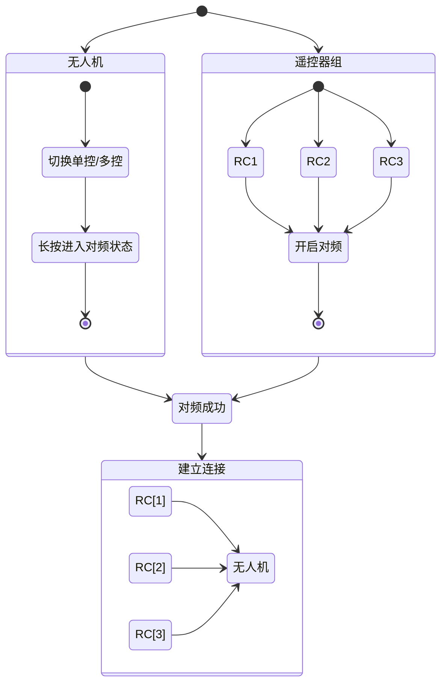
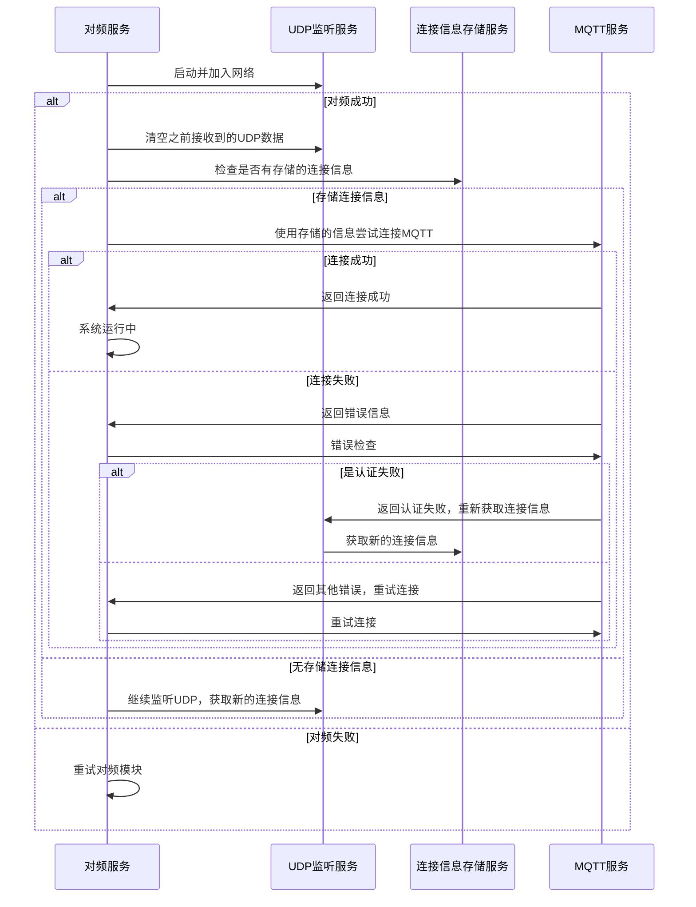
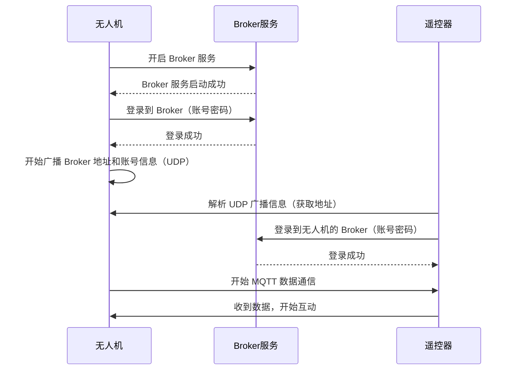

## 1. 前置条件 - 对频



## 2. 无人机 Broker 登录信息的发现

客户端（RC / 移动设备）与无人机的交互通过 MQTT 协议进行，但是因为考虑到不同场景下（植保 / 物流），无人机的 IP 是可变的，为了连接的健壮与可扩展性，连接的参数需要通过广播的方式发送给客户端

### 2.1 UDP 广播

发送方（无人机）在启动完成自己的 Broker 服务后，通过 UDP 的方式持续广播自己的相关信息

- Broker 的地址
- 端口
- 用户名/密码

```java
import java.net.DatagramPacket;
import java.net.DatagramSocket;
import java.net.InetAddress;

public class UdpSender {
    public static void broadcastIp(int port, long intervalMillis) {
        try (DatagramSocket socket = new DatagramSocket()) {
            socket.setBroadcast(true); // 启用广播模式
            String localIp = InetAddress.getLocalHost().getHostAddress();

            while (true) {
                String message = "Device IP: " + localIp;
                byte[] buffer = message.getBytes();

                // 广播地址，假设网段是 192.168.1.0/24
                InetAddress broadcastAddress = InetAddress.getByName("192.168.1.255");

                // 创建广播数据包
                DatagramPacket packet = new DatagramPacket(buffer, buffer.length, broadcastAddress, port);

                // 发送广播数据包
                socket.send(packet);
                System.out.println("Broadcast sent: " + message);

                // 等待指定时间间隔
                Thread.sleep(intervalMillis);
            }
        } catch (Exception e) {
            e.printStackTrace();
        }
    }
}
```

### 2.2 客户端接收
在该环节，客户端有以下相关角色

- 对频模块
	- 触发对频功能，加入无人机内部网络
	- 提供对频状态监听服务
- UDP 监听模块
	- 监听 UDP 广播，接收 MQTT 连接信息
	- 依赖于`对频模块`的连接
	- MQTT 连接成功后停止监听
- 连接信息存储模块
	- 存储上次对频后，MQTT 连接成功的数据
	- 省去 MQTT 连接前的步骤
	- 清空/修改数据的时机应当在触发对频操作后及 MQTT 校验失败时
- MQTT 模块
	- MQTT 服务核心模块，当前环节仅暴露以下接口
		- 携带连接参数的连接请求
		- 连接状态监听
#### 2.2.1 状态图

```mermaid
stateDiagram-v2
    [*] --> 对频模块: 启动
    对频模块 --> UDP监听模块: 加入网络成功
    对频模块 --> 对频模块: 加入网络失败，重试
    UDP监听模块 --> 连接信息存储模块: 接收到连接信息
    UDP监听模块 --> UDP监听模块: 无有效信息，继续监听
    连接信息存储模块 --> MQTT连接模块: 信息存储完成
    对频模块 --> UDP监听模块: 对频成功，清空之前的数据
    对频模块 --> MQTT连接模块: 对频成功，尝试连接存储的MQTT信息
    MQTT连接模块 --> 连接成功: 连接成功
    MQTT连接模块 --> UDP监听模块: 连接失败，错误检查
    UDP监听模块 --> 连接信息存储模块: 验证失败，重新获取连接信息
    MQTT连接模块 --> MQTT连接模块: 其他错误，重试连接
    连接成功 --> [*]: 系统运行中

```


#### 2.2.2 时序图


## 3. 无人机 Broker 的登录

### 3.1 无人机的自连接

无人机的 Broker 服务架设在自己内部，且自己作为默认授权的设备"优先"连接
这里优先的含义是，在 `无人机 Broker` 服务提供给外部连接前，应当确保 `无人机 Broker` 启动完成，并且自己的客户端（数据发布源）已经成功连接。

### 3.2 内网客户端登录

在经过了对频操作，使得遥控器加入了无人机的内网后，理论上遥控器，或者说用户，有着最高的权限，那么登入无人机的步骤应当更多的考虑"兼容性"，而非"安全性"。

兼容性：不同的无人机型号，不同无人机版本均可使用同一 APP 登录。
安全性：有着账号校验流程，以保证非可信设备异常接入。

基于此，在通过`UPD广播`广播 Broker 的地址的情况下，可以扩充广播内容，额外携带 `Broker` 的账号，密码，端口信息，APP 在成功解析到广播信息后即可正常登入 Broker。

### 3.3 时序图



## 4. 无人机关键信息获取

从这里开始就涉及到和无人机的数据通信，基础数据结构参考[[MQTT 数据结构]]里的遥测数据结构。

在这里无法使用通用遥测的 `Tpoic`接收数据，因为`apl_id`的关键信息未获取，故无人机的`PresetInfo`通过以下固定 Topic 的方式获取

```mqtt
Topic: "PresetInfo" // 使用固定的Topic获取飞机的一些关键信息
Body: {
	pb: AplProto, 
}
```


## 5. 云端 Broker 的连接

云端作为 MQTT 的一个重要通讯链路，负责辅助无人机内网通信，在内网断连状态下仍然可以做到远程控制与接收数据。

### 5.1 无人机（客户端）的连接

云端作为辅助链路，无人机需要在内网发布的信息，同等发布到云端，那么在网络可用的情况下，无人机应当登入云端 Broker，并在网络异常情况下，定期尝试登入云端 Broker。

登入云端后，应当具备一份消息2条链路发送，以及响应云端到来的消息的能力。

这里简单提到权限的概念以及鉴权的概念。无人机应当拥有最高权限，即发布所有命令的能力及响应所有命令的能力。并且云端能够对该设备进行鉴权识别。基于此提出2种鉴权登入的方式。

#### 5.1.1 双向加密

无人机与云端服务器使用相同密钥及加密算法。
无人机使用 SN 作为用户名，SN + TimeStamp 密钥加密作为密码。
登入操作时，云端使用该方式解密SN是否和用户名匹配及时间戳是否与当前时间相近决定是否允许登入。

#### 5.1.2 动态下发

无人机通过与服务端协定 Broker 用户名密码接口，通过请求 HTTPS 接口的方式获取密码并验证登入。

### 5.1 对频连接标识

对于内网条件下，有特定的对频回调用于判断


连接的客户端的分为以下几种角色：

- 无人机 
- 和无人机直连的遥控器
- 通过网络接入的非直连的设备（遥控器，手机）
- 无人机的拥有者
- 无人机的团队成员

以上成员共同组成无人机的第二个通讯链路：云端链路。
可以看出，他们的角色是不对等的，比如 直连的遥控器可以直接控制无人机，甚至控制飞行，但是很显然使用手机查看无人机是不允许使用无人机直接控制飞机。那么由此首先引入角色的权限概念

### 5.1 角色权限

>之所以没有在无人机 Broker那里增加角色概念，是因为无人机内网场景角色非常单一，仅仅是 1 对 多的状态，理论上直连的设备都拥有最高权限 （无控制权的设备仅仅当前没有控制权限，但是可以通过申请/抢占的方式提高自己的权限，那么理论上仍然拥有最高权限）

简单分析上面的各种角色，可以大致进行归类

- 完全控制权限


## 建立云端连接

## 设备权限分配

## 设备的互相发现及状态更新