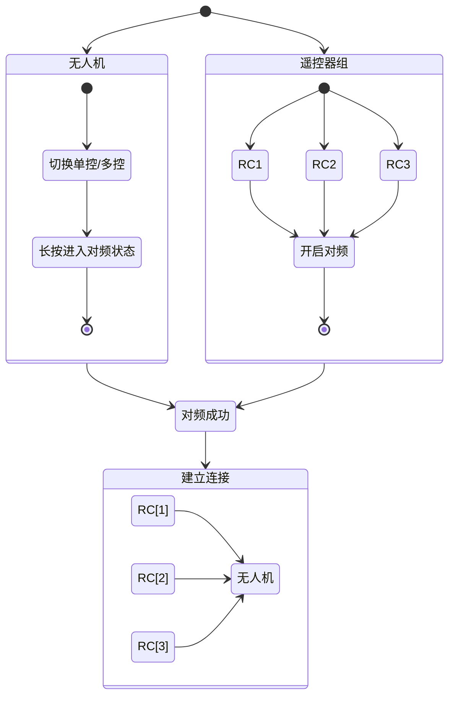
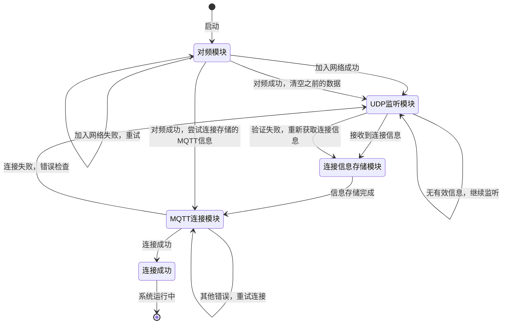
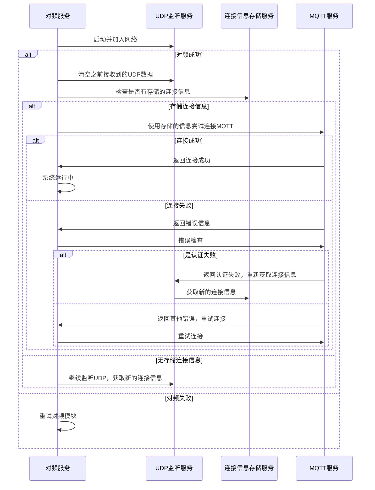

## 1. 前置条件 - 对频



## 2. 无人机 Broker 登录信息的发现

客户端（RC / 移动设备）与无人机的交互通过 MQTT 协议进行，但是因为考虑到不同场景下（植保 / 物流），无人机的 IP 是可变的，为了连接的健壮与可扩展性，连接的参数需要通过广播的方式发送给客户端

### 2.1 UDP 广播

发送方（无人机）在启动完成自己的 Broker 服务后，通过 UDP 的方式持续广播自己的相关信息

- Broker 的地址
- 端口
- 用户名/密码

``` java
import java.net.DatagramPacket;
import java.net.DatagramSocket;
import java.net.InetAddress;

public class UdpSender {
    public static void broadcastIp(int port, long intervalMillis) {
        try (DatagramSocket socket = new DatagramSocket()) {
            socket.setBroadcast(true); // 启用广播模式
            String localIp = InetAddress.getLocalHost().getHostAddress();

            while (true) {
                String message = "Device IP: " + localIp;
                byte[] buffer = message.getBytes();

                // 广播地址，假设网段是 192.168.1.0/24
                InetAddress broadcastAddress = InetAddress.getByName("192.168.1.255");

                // 创建广播数据包
                DatagramPacket packet = new DatagramPacket(buffer, buffer.length, broadcastAddress, port);

                // 发送广播数据包
                socket.send(packet);
                System.out.println("Broadcast sent: " + message);

                // 等待指定时间间隔
                Thread.sleep(intervalMillis);
            }
        } catch (Exception e) {
            e.printStackTrace();
        }
    }
}
```

### 2.2 客户端接收
在该环节，客户端有以下相关角色

- 对频模块
	- 触发对频功能，加入无人机内部网络
	- 提供对频状态监听服务
- UDP 监听模块
	- 监听 UDP 广播，接收 MQTT 连接信息
	- 依赖于`对频模块`的连接
	- MQTT 连接成功后停止监听
- 连接信息存储模块
	- 存储上次对频后，MQTT 连接成功的数据
	- 省去 MQTT 连接前的步骤
	- 清空/修改数据的时机应当在触发对频操作后及 MQTT 校验失败时
- MQTT 模块
	- MQTT 服务核心模块，当前环节仅暴露以下接口
		- 携带连接参数的连接请求
		- 连接状态监听
#### 2.2.1 状态图


#### 2.2.2 时序图


## 3. 无人机 Broker 的登录

### 3.1 无人机的自连接

无人机的 Broker 服务架设在自己内部，且自己作为默认授权的设备"优先"连接
这里优先的含义是，在 `无人机 Broker` 服务提供给外部连接前，应当确保 `无人机 Broker` 启动完成，并且自己的客户端（数据发布源）已经成功连接。

## 无人机关键信息获取

## 建立云端连接

## 设备权限分配

## 设备的互相发现及状态更新