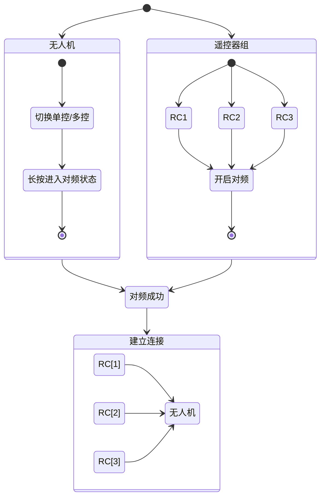
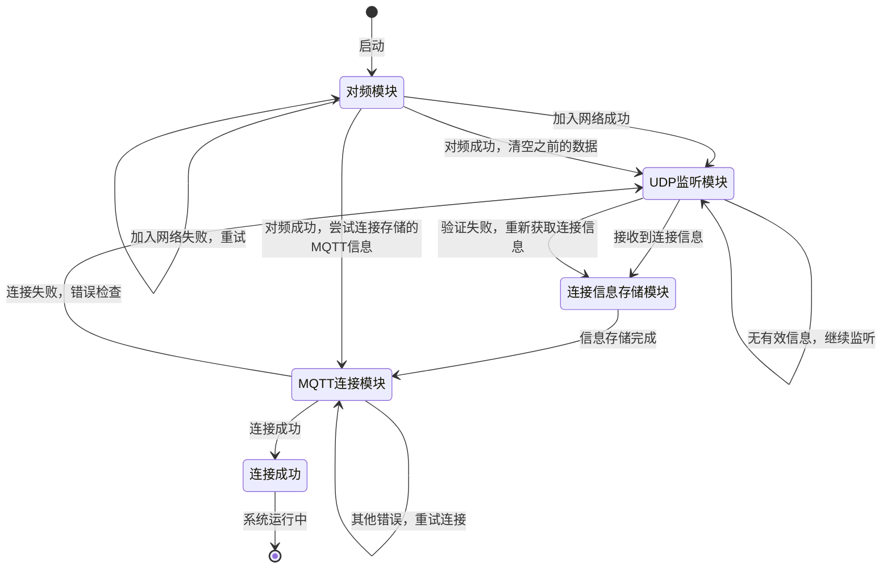
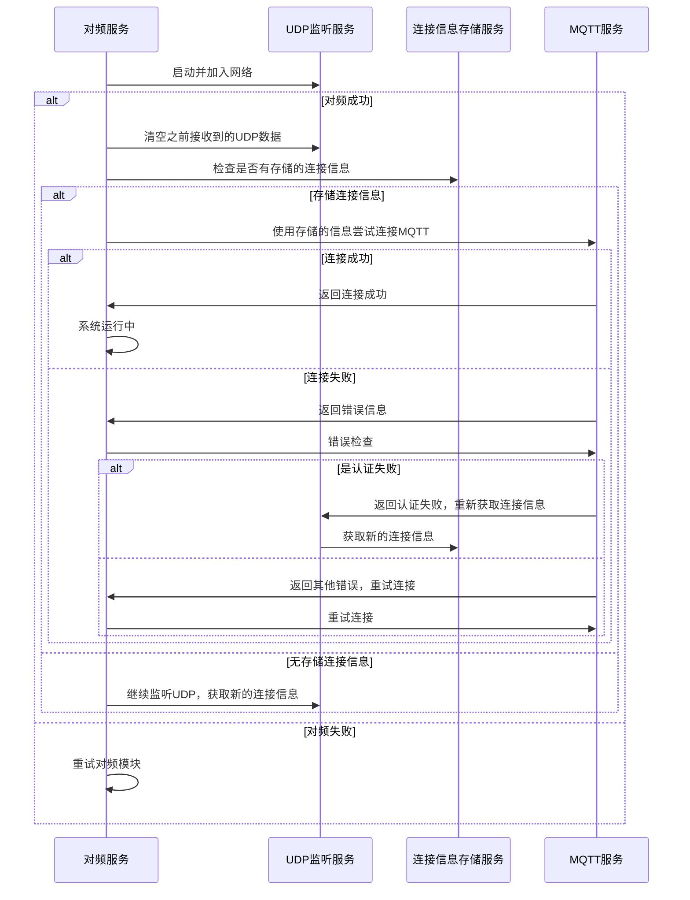
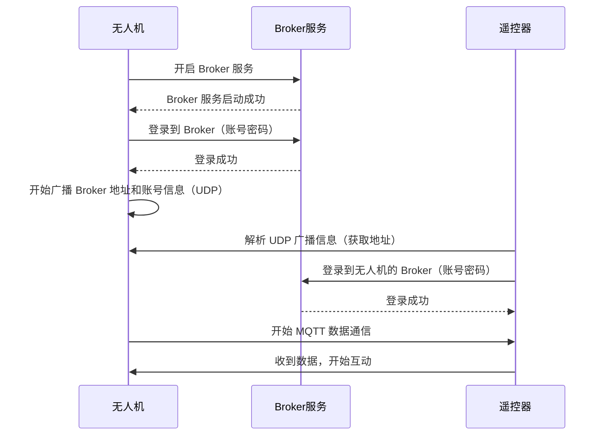

## 1. 前置条件 - 对频



## 2. 无人机 Broker 登录信息的发现

客户端（RC / 移动设备）与无人机的交互通过 MQTT 协议进行，但是因为考虑到不同场景下（植保 / 物流），无人机的 IP 是可变的，为了连接的健壮与可扩展性，连接的参数需要通过广播的方式发送给客户端

### 2.1 UDP 广播

发送方（无人机）在启动完成自己的 Broker 服务后，通过 UDP 的方式持续广播自己的相关信息

- Broker 的地址
- 端口
- 用户名/密码

```java
import java.net.DatagramPacket;
import java.net.DatagramSocket;
import java.net.InetAddress;

public class UdpSender {
    public static void broadcastIp(int port, long intervalMillis) {
        try (DatagramSocket socket = new DatagramSocket()) {
            socket.setBroadcast(true); // 启用广播模式
            String localIp = InetAddress.getLocalHost().getHostAddress();

            while (true) {
                String message = "Device IP: " + localIp;
                byte[] buffer = message.getBytes();

                // 广播地址，假设网段是 192.168.1.0/24
                InetAddress broadcastAddress = InetAddress.getByName("192.168.1.255");

                // 创建广播数据包
                DatagramPacket packet = new DatagramPacket(buffer, buffer.length, broadcastAddress, port);

                // 发送广播数据包
                socket.send(packet);
                System.out.println("Broadcast sent: " + message);

                // 等待指定时间间隔
                Thread.sleep(intervalMillis);
            }
        } catch (Exception e) {
            e.printStackTrace();
        }
    }
}
```

### 2.2 客户端接收
在该环节，客户端有以下相关角色

- 对频模块
	- 触发对频功能，加入无人机内部网络
	- 提供对频状态监听服务
- UDP 监听模块
	- 监听 UDP 广播，接收 MQTT 连接信息
	- 依赖于`对频模块`的连接
	- MQTT 连接成功后停止监听
- 连接信息存储模块
	- 存储上次对频后，MQTT 连接成功的数据
	- 省去 MQTT 连接前的步骤
	- 清空/修改数据的时机应当在触发对频操作后及 MQTT 校验失败时
- MQTT 模块
	- MQTT 服务核心模块，当前环节仅暴露以下接口
		- 携带连接参数的连接请求
		- 连接状态监听
#### 2.2.1 状态图


#### 2.2.2 时序图


## 3.  连接至无人机 Broker

### 3.1 无人机的自连接

无人机的 Broker 服务架设在自己内部，且自己作为默认授权的设备"优先"连接

这里优先的含义是，在 `无人机 Broker` 服务提供给外部连接前，应当确保 `无人机 Broker` 启动完成，并且自己的客户端（数据发布源）已经成功连接。

### 3.2 内网客户端登录

在经过了对频操作，使得遥控器加入了无人机的内网后，理论上遥控器，或者说用户，有着最高的权限，那么登入无人机的步骤应当更多的考虑"兼容性"，而非"安全性"。

兼容性：不同的无人机型号，不同无人机版本均可使用同一 APP 登录。
安全性：有着账号校验流程，以保证非可信设备异常接入。

基于此，在通过`UPD广播`广播 Broker 的地址的情况下，可以扩充广播内容，额外携带 `Broker` 的账号，密码，端口信息，APP 在成功解析到广播信息后即可正常登入 Broker。

### 3.3 时序图



## 4. 无人机关键信息获取

从这里开始就涉及到和无人机的数据通信，基础数据结构参考[[MQTT 数据结构]]里的遥测数据结构。

在这里无法使用通用遥测的 `Tpoic`接收数据，因为`apl_id`的关键信息未获取，故无人机的`PresetInfo`通过以下固定 Topic 的方式获取

```mqtt
Topic: "PresetInfo" // 使用固定的Topic获取飞机的一些关键信息
Body: {
	pb: AplProto, 
}
```


## 5. 连接至云端 Broker

云端作为 MQTT 的一个重要通讯链路，负责辅助无人机内网通信，在内网断连状态下仍然可以做到远程控制与接收数据。

### 5.1 无人机（客户端）的连接

云端作为辅助链路，无人机需要在内网发布的信息，同等发布到云端，那么在网络可用的情况下，无人机应当登入云端 Broker，并在网络异常情况下，定期尝试登入云端 Broker。

登入云端后，应当具备一份消息2条链路发送，以及响应云端到来的消息的能力。

这里简单提到权限的概念以及鉴权的概念。无人机应当拥有最高权限，即发布所有命令的能力及响应所有命令的能力。并且云端能够对该设备进行鉴权识别。基于此提出2种鉴权登入的方式。

#### 5.1.1 双向加密

无人机与云端服务器使用相同密钥及加密算法。

无人机使用 SN 作为用户名，SN + TimeStamp 密钥加密作为密码。

登入操作时，云端使用该方式解密SN是否和用户名匹配及时间戳是否与当前时间相近决定是否允许登入。

#### 5.1.2 动态下发

无人机通过与服务端协定 Broker 用户名密码接口，通过请求 HTTPS 接口的方式获取密码并验证登入。

### 5.2 对频连接标识

对频连接标识，用于确定当前该设备是否在无人机内网内，或者说是否在本地的对频周期内，用于判断该设备是否有完整的无人机控制权限。

对应的，若未连接，则不应当连入任何 Broker。

对于内网条件下，有特定的对频回调用于判断是否连接。或者说在内网条件下，若断开和无人机的连接，则无人机的 Broker 也会直接断开。

但是在外网条件下，需要有一个条件，用于使得在触发了无人机的新的对频周期后，能够有效的停止上一个周期的对频设备的连接，这个称为无人机的“对频连接标识”。

#### 5.2.1 对频连接标识的场景

##### 5.2.1.1 云端登录鉴权

遥控器设备在与无人机内网连接后，应当继续登入云端 Broker，且拥有该无人机的完全操控权限。

需要注意以下几点：

- 已连接过无人机，把一些无人机信息保存在本地的设备，可以直接连接云端，且允许登录。
- 已连接过无人机，但是无人机经过对频导致对频信息发生改变后，旧的数据不应登录云端。

那么就需要有一个鉴权标识，能够包含当前无人机的基本信息及对频过期信息。

##### 5.2.1.2 无人机重新对频

在无人机重新对频后，已连接的设备（无人机，或云端服务器）能够识别出对频信息更改，能够使得当前已连接设备断开。

对于内网环境的设备来说比较容易区别，如果对频断开，则直接会导致内网 MQTT 断开。

对于云端连接的场景，需要存储内网环境下获取的无人机连接标识，并在接收到无人机发布的云端消息时进行匹配，确定当前状态是断连还是未对频。

#### 5.2.2 对频连接标识发布方式

发布对频连接标识有2种方式：

1. 无人机使用云端缓存消息，连接设备监听 Topic 后可直接获取上次的消息，但是当一个新匹配的遥控器对频无人机，存在立刻返回上次对频的标识的信息干扰。
2. 无人机定时`1HZ` 发布对频标识。该方式发布信息比较频繁，但是干扰较少。以下使用该方式实现。

```mqtt
Topic: /t/a/{apl_id}/from_apl_q0 // 可直接使用遥测Topic
Body: {
	pb: AplProto, 
}
```


### 5.3 RC 客户端的连接

遥控器有着对无人机操控的最高权限，该权限仅对“已连接”无人机开放，那么无人机的对频标识就作为一个验证及控制标识存在。

#### 5.3.1 RC 客户端的验证

RC 客户端在连接无人机后，可获取到以下关键信息，这些信息会在获取后缓存到本地：

- 无人机的PresetInfo：无人机SN 的关键信息
- 无人机的此次对频标识
- 对频成功时间

以上可作为参数向服务端请求此次登入的一次性账号密码，服务端需要有着基于以上信息识别 RC 客户端合法的能力。

附：服务端同样具备了识别 RC 不合法的能力：对频标识不匹配，那么可把不合法的账号强行断开。

#### 5.3.2 RC 客户端的连接场景

##### 5.3.2.1 RC 初次连接

这种场景下，RC 的连接步骤应当是如下

1. 对频成功，登入无人机 Broker，获取无人机关键信息并进行通信，存储关键信息
2. 无人机发布的关键信息云端同样可以正常接收（若无网，则无人机无法登入云端，即使RC网络可用，该链路仍然等同于失效，不考虑该场景）
3. 循环尝试请求云端 Broker 账号信息，携带无人机信息验证
4. 登入云端 Broker 建立连接

##### 5.3.2.2 RC 重启，与无人机断连（已对频）

1. 无人机仍然在持续向云端发布自身关键信息
2. 遥控器使用上次对频成功的信息请求云端
3. 验证成功，登入云端 Broker，接受无人机信息

##### 5.3.2.3 RC 已连接云端，无人机触发对频

1. 无人机触发对频，对频连接标识发布更新
2. 云端识别对频标识更新，已连接设备踢出（可选）
3. 遥控器对比收到的无人机对频标识，与本地不同
4. 遥控器主动断开连接

### 5.4 其它设备的连接

在连接至云端 Broker 的角色除了无人机和 RC 外，还存在2种：

- 移动设备
- 网页后台

整体可以统称为三方客户端，这类客户端没有直接参与无人机对频的步骤，使用者通常为无人机的所有者，及无人机的被授权者（用户，或团队成员）

这些角色仅有观察无人机状态的能力，以及极少，可配置的操作无人机的能力，通常情况下应当通过用户组/授权的判断的方式获取到无人机的信息。


### 5.5 角色权限

连接的客户端的分为以下几种角色：

- 无人机 
- 和无人机直连的遥控器
- 通过网络接入的非直连的设备（遥控器，手机）
- 无人机的拥有者
- 无人机的团队成员

以上成员共同组成无人机的第二个通讯链路：云端链路。

可以看出，他们的角色是不对等的，比如 直连的遥控器可以直接控制无人机，甚至控制飞行，但是很显然使用手机查看无人机是不允许使用无人机直接控制飞机。那么由此首先引入角色的权限概念

>之所以没有在无人机 Broker那里增加角色概念，是因为无人机内网场景角色非常单一，仅仅是 1 对 多的状态。
>理论上直连的设备都拥有最高权限 （无控制权的设备仅仅当前没有控制权限，但是可以通过申请/抢占的方式提高自己的权限，那么理论上仍然拥有最高权限）

简单分析上面的各种角色，可以大致进行归类

- 非敏感权限
- 敏感权限
- 完全权限

#### 5.5.1 非敏感权限

非敏感权限用于信息展示或获取，如 APP 里显示无人机的实时位置，飞行轨迹，当前无人机正在执行的任务，主动查询无人机工作状态等等，不会对无人机有任何干扰，仅涉及无人的状态

该权限所有角色均拥有。

#### 5.5.2 敏感权限

敏感权限，涉及如控制无人机返航，无人机执行新任务，操作无人机开关项等，属于存在对无人机的安全性及稳定性造成影响的功能。

#### 5.5.3 完全权限

完全的权限在包含了以上所有权限，还包含了诸如杆量此类的权限。

#### 5.5.4 角色的重新划分

非敏感权限： 所有人

敏感权限：根据角色配置/后端配置，控制对应角色的命令发送

- 三方客户端
- 云端后台

完全权限：
有控制权限的RC可拥有，特定角色根据配置可拥有完全权限

## 6. 多设备权限管理

### 6.1 为何需要权限管理

在设计架构里，内网环境是无人机是1对多，云端场景是多对多。

前面提到的完全权限，同一时刻仅有一个人可以获取该权限，其余角色会失去该权限，那么涉及到以下概念：

- 什么样的角色可以获取完全权限
- 如何知道我有完全权限
- 如何知道我可以有完全权限
- 如何申请完全权限

基于此，需要一个“规则”规定`完全权限`的转让与申请。毕竟不是谁都可以获取权限，也不可能有2个人可以拥有权限。

### 6.2 分布式 or 集中式

旧版的系统里，该控制集成在无人机设备上，apollo 并不能得知谁有权限，apollo 系统仅有数据发布及接收能力。控制功能集成在 apollo 的上层。是一种“集中”控制的方式。

#### 6.2.1 集中式

集中式的好处在于有一个统一控制中心，用于安排权限分配，所有角色直接与该中心交互即可，相对简单。在我们的设计架构里，该控制中心仅可放置于无人机上。

但是集中控制权限的方式有以下缺点：
1. 无控制权会把非敏感权限全部收回（MQTT 中已不存在该问题）
2. 无法正确识别断连及权限转让/存在延迟
3. 高度依赖硬件支持

集中式的更重要的一个问题在于，需要有一个绝对中枢，统一控制权限，那么作为控制中心，就需要明确所有的客户端信息及可控权限，一方面 MQTT 的设计思想就是发布者和订阅者互相独立不可知，一方面又要 `权限控制中心` 能够感知所有设备，不符合设计需求。另一方面，会加重无人机的负担，迭代，升级，稳定性都会受到考验。

#### 6.2.2 分布式

分布式的定义，各个客户端的自己请求及协商转让

- 依据客户端优先级自动确认一个完整控制权限的客户端
- 客户端可请求控制并获取/不获取控制权

分布式的方式在于，各个客户端的控制权由自身控制，不需要中心（无人机）的参与，可以使得无人机角色独立出去，专注于发布状态与执行命令，权限控制由各个客户端自行控制。

### 6.3 设备的互相发现

不涉及完全控制权限的场景，可以由各端自行实现权限拦截，不需要知道客户端彼此的存在。

对于完全控制权限，属于特殊场景

- 仅可存在至多1个设备有完全控制权限
- 可能请求完全控制权限的设备之间可以通信（抢占/请求权限）
- 都没有控制权限时，其中设备需要自动获取权限

该场景下，我们产生以下需求：

- 当前“候选”有几个
- 这些设备分别通过什么渠道连接
- 控制权在哪里
- 自动分配的控制权怎么决定

由此，引出了设备的心跳信息

#### 6.3.1 心跳信息

心跳信息存在于“可获取完全控制权限的设备”之间。它有以下作用

- 通知设备的在线/离线
- 确定当前控制权所属（或无控制权）
- 确定设备的优先级

#### 6.3.1.1 数据结构

Topic： /t/a/{apl_id}/heartbeat

```ProtoBuf
message Heartbeat {
  enum Type {
      RC,
      Drone,
      Mobile
      ...
  }
  Type type = 1;
  string indentify = 2; // 
  int priority = 3; // 设备的优先级，对于 无人机无意义，默认是0，RC根据主/副控来决定
  enum Capacity {
      NONE = 0，
      MONITOR = 1,
      AUTO_DRIVER = 2,
      MANUAL_DRIVER = 4，
  }
  bool inControll = fales, // 是否有控制权 
  int capacity = 4;  // 该设备的能力  -  是否需要
}

```

##### 6.3.1.2 心跳规则

所有设备应当向 无人机 Broker 及 云端 Borker 以 `1Hz`的频率发送心跳信息。

##### 6.3.1.3 设备在线判断

发现同网络下的设备应当是应用的基本能力，接入无人机环境有2个方式

- 无人机 Broker： 检测到该服务器获取的心跳，则判断本地在线，超过5秒失联则判定离线
- 云端 Broker：检测到该服务器获取的心跳，则判断云端在线，超过5秒失联则判定离线


### 6.3 完全权限的自动获取

假设存在3个遥控器同时与无人机对频，且云端也存在一个可以有完整控制权限的用户。那么初次对频情况下权限应当给谁。

若没有优先级的概念，则完全无法实现，毕竟随机分配不合理，也不可控。

#### 6.3.1 权限优先级

对于优先级的定义，RC 是可被赋予优先级，三方设备无优先级/优先级最低。毕竟仅在特殊场景下可能会用到云端控制，常规情况下，仅RC拥有权限优先级。

RC的权限优先级由遥控器默认定义，如主控，辅控1，辅控2。当全部连接时，权限应当默认给到主控。

#### 6.3.2 权限自动获取场景

- 初次对频，无任何设备取得控制权
- 任何时期，有设备掉线，控制权转让

#### 6.3.3 权限申请

假设存在A（0） B（1） C（3）的3个设备同时对频。

#### 6.3.4何时开启自动获取权限

以下所有条件均满足，则触发自身请求权限

1. 持续监听心跳消息，3s内接收到的其他设备心跳不包含有权限的设备
2. 自身设备存在优先级，且接收到的心跳设备优先级均低于自身
3. 3s内未收到其他设备请求权限消息
4. 不存在正在进行的权限请求

#### 6.3.5 如何请求权限

发起请求权限时，应当携带自身ID，优先级等信息，以固定 Topic 发布，并且请求方应当以 `1Hz`的频率发布消息以确定当前正处于权限请求流程

#### 6.3.6 如何确定权限归属

当收到其他设备发布的请求权限信息，需要给与回复，任何一个设备不同意则此次权限申请终止，等待下次权限申请

接收到权限申请后，需要根据以下判断：

- 若请求方无优先级，或优先级比自身低，则拒绝请求
- 若自身已有控制权，则拒绝请求

拥有/未获取控制权后，应当调整心跳内容，将控制权公布。并发布权限转让流程结果，声明流程结束。


### 6.4 完全权限的协商

除了自动获取控制权外，存在控制权限转让的场景

#### 6.4.1 可以发起请求权限的设备

以下设备可以发起请求：

- 存在于无人机环境内的设备：该设备正常发起心跳数据/可以请求权限
- 当前没有正在进行的权限协商流程：未收到权限请求流程遥测
- 自身未有权限

#### 6.4.2 如何请求权限

发起请求权限时，应当携带自身ID，优先级等信息，以固定 Topic 发布，并且请求方应当以 `1Hz`的频率发布消息以确定当前正处于权限请求流程

#### 6.4.3 如何确定权限归属

当收到其他设备发布的请求权限信息，若自身拥有权限，则应当以可视化页面告知当前用户，让用户决定是否同意，依据用户选择回复请求方是否给与权限

拥有/未获取控制权后，应当调整心跳内容，将控制权公布。并发布权限转让流程结果，声明流程结束。


### 6.5 敏感权限

#### 6.5.1 什么是敏感权限

敏感权限属于会影响无人机功能，不能随意分配的权限。如下发任务，开启开关等等。

完全控制权限默认拥有所有敏感权限。

#### 6.5.2 敏感权限的分配

敏感权限用于特定设备，短暂/临时控制无人机部分功能，不用经过协商，无法请求完整权限，受限于服务端的配置。

客户端应当读取账号对于无人机的敏感权限配置，仅在配置范围内发送命令

#### 6.5.3 敏感权限的拦截？

1. 是否在当前存在完全控制权限的设备时，需要该设备二次确认
2. 是否需要再broker上面做二次拦截，根据登入账号的权限进行命令拦截


## 7. 消息去重

### 7.1 遥测消息

### 7.2 请求消息