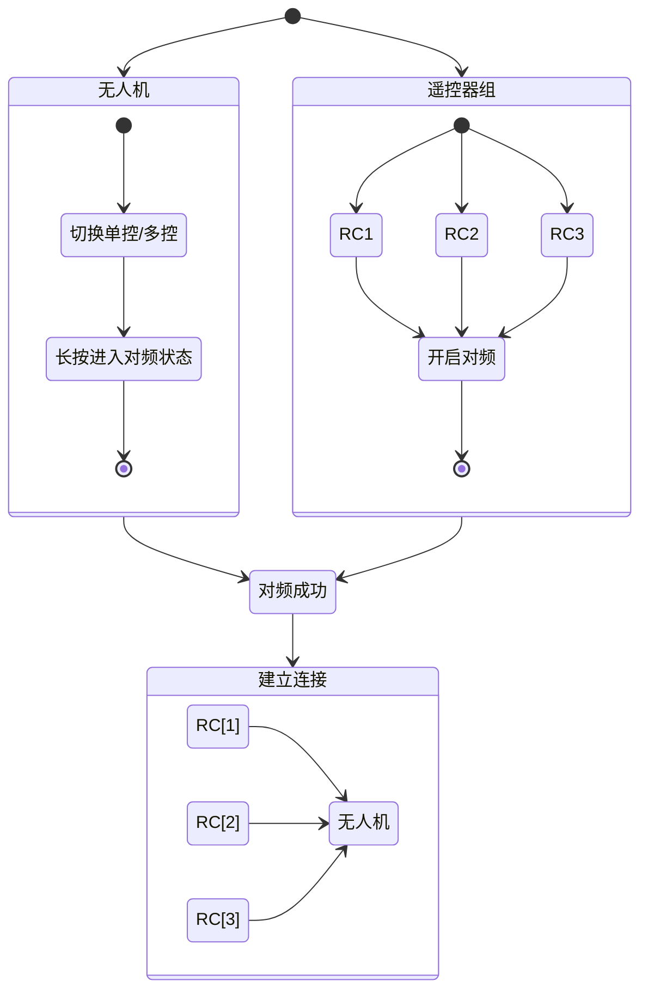
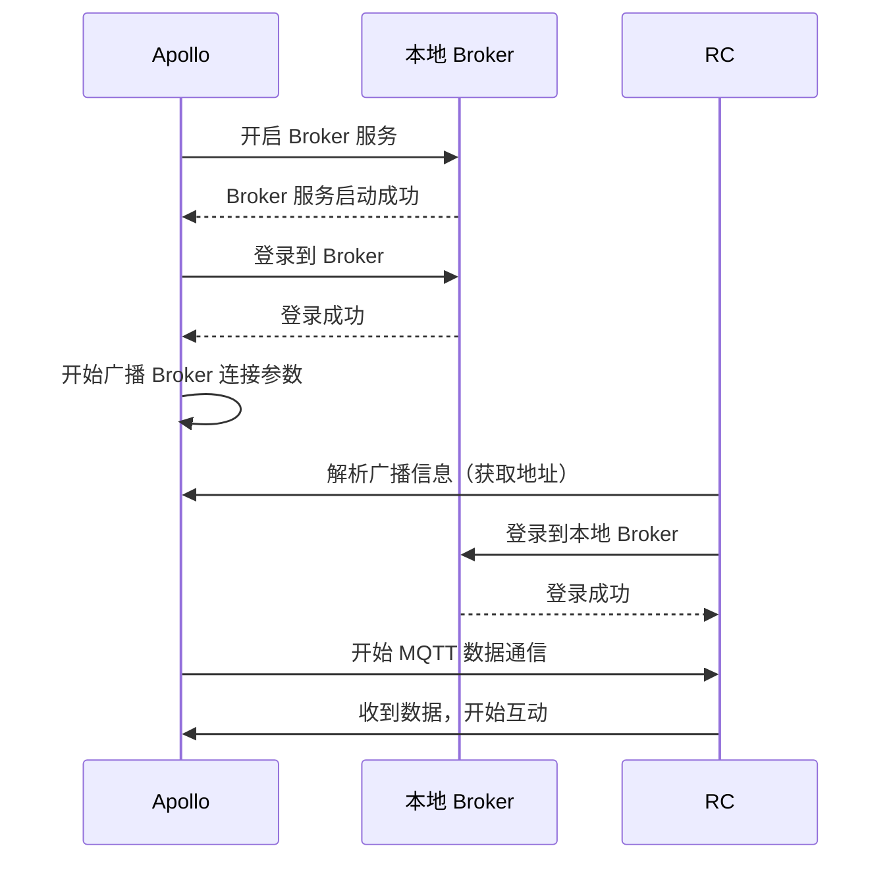

## 1. 定义

### 1.1 MQTT

MQTT（Message Queuing Telemetry Transport）是一种轻量级的、基于发布/订阅模式的消息协议。

本设计文档中，不同设备间的通信方式主要采用 `MQTT` 协议。涉及发送消息，接收消息如无特殊提及，均使用 `MQTT` 协议的方式进行通信

#### 1.1.1 Broker

MQTT的核心思想是**客户端-代理（Broker）架构**。Broker 是其中承载接入客户端连接及消息转发的功能。

本设计文档中，存在 2 个 Broker，一个搭建在无人机内部，一个搭建在云端服务器。为表述简单，后续使用以下名词代替
- 本地 Broker ： 无人机内部 Broker
- 云端 Broker ： 服务器内部 Broker

#### 1.1.2 Client

所有连接至 Broker 的设备都可以称为客户端。根据客户端类型有以下定义，后文将用定义的名词代替对应客户端：

- RC ： 遥控器
- Apollo ：无人机自身内部的客户端，直连到`本地 Broker`
- 三方客户端 ： 如手机APP，用户后台系统等
- 云端服务器：涉及到云端业务的 Server 服务

#### 1.1.3 消息 Topic

`MQTT` 消息的基本结构：

```mqtt
Topic: XXX
Data: byte[]
```

每个消息都是依赖于消息本身的 `Topic` 进行发布或监听。数据本体正常以 byte 数组的方式传输。

本文中所指 `Topic` 如没有特殊说明，都指代 `MQTT Topic`，现有 `PB Topic` 不作调整也不做定制。
#### 1.1.3 MQTT 连接要素

若想要能够进行 MQTT 通信，需要保证以下要素

1. `Client` 使用正确的连接参数登入`Broker`
	- `Broker` 服务地址
	- `Broker` 服务端口
	- 用户名（可选）
	- 密码（可选）

2. `Broker` 配置账号验证：
	- 若不配置账号密码，则输入任意账号密码都可以登入
	- 若配置账号密码，仅允许预配置的账号密码登入

注：`MQTT` 允许多个相同账号密码登入
### 1.2 对频

对频是 `RC` 与 `无人机` 建立内网连接的一个方式。具体硬件实现不在此讨论，通过该方式后，`RC` 与 `无人机` 的通信不依赖于4G网络。



### 1.3 加密

本文部分通信中，存在安全风险，会使用`RSA加密`并加盐的方式加密，以确保数据不会被伪造，不会被解密，文中的所有的加密都指代该种加密。
// 演示图

### 1.4 权限

`Client` 对于发布 `Topic` 有一些限制，如在双控的环境下，没有控制权的`RC`无法对飞机进行“控制”，仅仅可以对飞机进行“观测”。这里引出“权限”概念。

`权限` 仅仅是对身份的描述，即对应 `Client` 有着对应能力的可能性，并非直接获取该能力，能力需要激活（Activate）。

`权限`仅针对于 `Apollo` 以外的 `Client`。`Apollo` 发布消息不受任何限制。
#### 1.4.1 权限分级

参考现在的比较复杂的物流机场景，可以概括为以下几类权限

- 游客权限（仅观察）
- 部分执行权限 （下发任务到无人机）
- 一定条件下完全控制无人机权限（在后台控制无人机飞行等操作）
- 完全权限（RC控制无人机）

那么基于此，我们定义了以下3类权限

| 权限等级 | 介绍    | 适用场景                          | 赋予方式                          | 激活                          |
| ---- | ----- | ----------------------------- | ----------------------------- | --------------------------- |
| P2   | 仅观察权限 | 后台观察，远程展示                     | 所有授权登录的 `Client` 都至少是该等级,     | 默认激活                        |
| P1   | 可部分授权 | 后台下发任务，控制无人机部分开关，手机APP控制飞机返航等 | 特定`Client`里自带或服务器配置授权项        | 服务端动态配置                     |
| P0   | 完全权限  | 与无人机直连的 RC 遥控器都拥有该权限          | `RC` 在与无人机对频完成后，自动获取该无人机的完全权限 | 条件激活，同一个无人机只存在一个`Client`被激活 |

如`P0` 权限，仅代表该`Client`存在完全控制的可能性。


#### 1.4.2 `P0 权限`激活模式简述

拥有`P0 权限`的设备，在被激活（Activated）后可完全控制无人机，其余`P0` 设备失去激活。

不同于现有方案的集中控制，即有一个中心服务，用于感知所有设备及`P0权限`的激活。该中心只能放置于`无人机`内，然而在不确定接入设备，及 `MQTT` 的架构下（发布者与订阅者互相不可感知），需要调整架构为，接入设备自行协商/转让`P0权限`激活状态，而非中心控制。

// TODO 演示图

## 2. 本地 Broker

`RC` 与 `Apollo` 的通信使用 MQTT 协议，协议连接要素前面有提及，必要地需要 `本地 Broker` 的地址和端口，但是因为考虑到不同场景下（植保 / 物流），`本地 Broker` 地址及端口是可变的，需要一种发现连接信息的方式。

用户名与密码不做约束，内部约定固定值即可。
### 2.1 连接信息的发现
#### 2.1.1 数传模块

直接使用数传模块是比较安全的方式，但是当前不确定是否有提供设备发现的方法。

若有提供相关方法，使用数传直接发布`本地 Broker` 的地址及端口信息。

#### 2.2.2 UDP 广播

该方式为备用方式，在没有有效获取连接信息的方式下，使用 UPD 广播的方式向内网设备持续广播信息。

该信息需要`加密`。

```java
import java.net.DatagramPacket;
import java.net.DatagramSocket;
import java.net.InetAddress;

public class UdpSender {
    public static void broadcastIp(int port, long intervalMillis) {
        try (DatagramSocket socket = new DatagramSocket()) {
            socket.setBroadcast(true); // 启用广播模式
            String localIp = InetAddress.getLocalHost().getHostAddress();

            while (true) {
                String message = "Device IP: " + localIp;
                byte[] buffer = message.getBytes();

                // 广播地址，假设网段是 192.168.1.0/24
                InetAddress broadcastAddress = InetAddress.getByName("192.168.1.255");

                // 创建广播数据包
                DatagramPacket packet = new DatagramPacket(buffer, buffer.length, broadcastAddress, port);

                // 发送广播数据包
                socket.send(packet);
                System.out.println("Broadcast sent: " + message);

                // 等待指定时间间隔
                Thread.sleep(intervalMillis);
            }
        } catch (Exception e) {
            e.printStackTrace();
        }
    }
}
```

### 2.2 RC 设备连接

现在需要`RC` 连接 `本地 Broker` ，以下模块均在`RC`内部，使用笼统的模块对`RC`连接进行简要的流程概括

- 对频模块
	- 触发`对频`，使得`RC` 加入内网
	- 提供对频状态监听服务
- 本地 Broker信息模块
	- 获取 MQTT 连接信息，并缓存本地
- MQTT 通信模块
	- 连接服务
	- 发布信息
	- 接收信息

// TODO 状态图
### 2.3 Apollo 连接

`Apollo` 与 `本地 Broker` 共处于无人机内，`Apollo`作为默认授权的设备"优先"连接

优先的含义是，在 `本地 Broker` 连接信息发布前，应当确保 `本地 Broker` 启动完成，并且`Apollo` 已经成功连接。

这里连接不存在安全问题，连接参数预置在 `Apollo` 内部即可，不存在获取连接参数的过程。




### 2.4 无人机关键信息获取

从这里开始就涉及到和无人机的数据通信，基础数据结构参考[[MQTT 数据结构]]里的遥测数据结构。

在这里无法使用通用遥测的 `Tpoic`接收数据，因为`apl_id`的关键信息未获取，故无人机的关键信息通过以下固定 `Topic` 的方式获取

注：该消息仅适用于`本地 Broker` 发布，不可通过`云端 Broker`发布，通过`云端 Broker` 登入的 `Client` 应当使用其他方式获取`apl_id`。（账号配置，团队配置等）

```mqtt
Topic: "PresetInfo" // 使用固定的Topic获取飞机的一些关键信息
Body: {
	pb: AplProto, 
}
```


## 3. 云端 Broker

由于`MQTT`的特性，已登入`Broker`的设备能够监听任何`Topic`的消息，那么就需要在登入前做好前置鉴权。

鉴权有2个方式：

- 账号下发
- `Broker`校验

### 3.1 Apollo 连接

云端作为辅助链路，`Aollo`需要在内网发布的信息，同等发布到云端，那么在网络可用的情况下，无人机应当登入`云端 Broker`，并在网络异常情况下，定期尝试登入`云端 Broker`。

连接成功后，应当具备一份消息2条链路发送，以及响应云端到来的消息的能力。

#### 3.1.1 密码加盐

`Apollo` 与 `云端 Broker` 使用相同`加密`。

`Apollo`使用 `SN` 作为用户名，加盐加密作为密码。

登入操作时，`云端 Broker` 使用该方式解密SN是否和用户名匹配及时间戳是否与当前时间相近决定是否允许登入。

#### 3.1.2 动态下发

`Apollo`通过与服务端协定 `云端 Broker` 用户名密码接口，通过请求 HTTPS 接口的方式获取密码并验证登入。

### 3.2 对频连接标识

对频连接标识，用于确定当前该设备是否在无人机内网内，或者说是否在本地的对频周期内，用于判断该设备是否有完整的无人机控制权限。

对应的，若未连接，则不应当连入任何 `Broker`。

对于内网条件下，有特定的对频回调用于判断是否连接。或者说在内网条件下，若断开和无人机的连接，则`本地 Broker` 也会直接断开。

但是在外网条件下，需要有一个条件，用于使得在触发了无人机的新的对频周期后，能够有效的停止上一个周期的对频设备的连接，这个称为无人机的“对频连接标识”。

该名称后续简写为`对频标识`

#### 3.2.1 对频连接标识的场景

##### 3.2.1.1 云端登录鉴权

遥控器设备在与无人机内网连接后，应当继续登入`云端 Broker`，且拥有该无人机的完全操控权限。

需要注意以下几点：

- 已连接过无人机，把一些无人机信息保存在本地的设备，可以直接连接云端，且允许登录。
- 已连接过无人机，但是无人机经过对频导致`对频标识`发生改变后，旧的数据不应登录云端。

那么就需要有一个鉴权标识，能够包含当前无人机的基本信息及对频过期信息。

##### 3.2.1.2 无人机重新对频

在无人机重新对频后，能够识别出`对频标识`更改，能够使得当前已连接设备断开。

对于内网环境的设备来说比较容易区别，如果对频断开，则直接会导致`本地 Broker` 断开。

对于云端连接的场景，需要存储`本地 Broker`获取的`对频标识`，并在接收到来自`云端 Broker`的`对频标识`进行匹配，确定当前状态是`断连`还是`重新对频`。

#### 3.2.2 Apollo 发布对频标识

发布`对频标识`有 2 种方式：

1. `MQTT`有一个特性，可以缓存一个`Topic`的最后一个消息。那么可以让`Apollo`使用该能力，将该`对频标识`使用固定 `Topic`发布，连接设备监听 `Topic`后可直接获取上次的消息。该方式存在缺点，无人机重新对频，新的`RC`会立刻收到上次`对频标识`。
1. 无人机定时`1HZ` 发布`对频标识`。该方式发布信息比较频繁，但是干扰较少。以下使用该方式实现。

```mqtt
Topic: /t/a/{apl_id}/from_apl_q0 // 可直接使用遥测Topic
Body: {
	pb: AplProto, 
}
```


### 3.3 RC 设备连接

`RC` 对与其连接的`Apollo`拥有`P0`权限，但是该权限仅能对匹配的`对频标识`生效。

那么 `RC` 的连接过程中，需要增加`对频标识`的校验。

#### 3.3.1 RC 连接鉴权

`RC`连接`本地 Broker`后，可获取到无人机关键信息，这些信息应当缓存到本地：

- 无人机关键信息(sn / boom_id)
- `对频标识`
- 对频时间戳

以上信息作为参数通过HTTPS请求此次登入的一次性账号密码，服务端需要有着基于以上信息识别 `RC`合法的能力。

附：服务端同样具备了识别 `RC` 不合法的能力：对频标识不匹配，那么可把不合法的账号强行断开。

#### 3.3.2 RC 连接场景分析

##### 3.3.2.1 RC 初次连接

这种场景下，`RC` 的连接步骤：

1. 对频成功，登入`本地 Broker`，获取关键信息,`对频标识`后，连接`云端 Broker`
2. `Apollo` 通过`云端 Broker`发布的`对频标识`，服务端同样可以正常接收（若无网，则`Apollo` 无法登入云端，即使`RC`网络可用，该链路仍然等同于失效，不考虑该场景）
3. 循环尝试请求`云端 Broker` 账号信息
4. 登入`云端 Broker` 建立连接

##### 3.3.2.2 已对频但`本地Broker`断开

1. `Apollo` 仍然在持续发布`对频标识`
2. `RC`使用上次对频成功的信息请求账号
3. 验证成功，登入`云端 Broker`建立连接

##### 3.3.2.3 RC 仅连接`云端 Broker`，无人机触发对频

1. 无人机触发对频，`对频标识`发布更新
2. `云端 Broker` 识别 `对频标识` 更新，踢出`RC`（可选）
3. `RC`接收到`对频标识`，检测发生变化
4. `RC`主动与`云端 Broker`

### 3.4 其它设备的连接

可连接至`云端 Broker` 的角色除了无人机和 RC 外，还存在2种：

- 移动设备
- 网页后台

整体可以统称为三方客户端，这类客户端没有直接参与无人机对频的步骤，使用者通常为无人机的所有者，及无人机的被授权者（用户，或团队成员）

这些角色仅有观察无人机状态的能力，以及极少，可配置的操作无人机的能力，通常情况下应当通过用户组/授权的判断的方式获取到无人机的信息。

## 4. `P0 权限`激活

### 4.1 为何需要权限激活管理

对于`P0` 级权限，同一时刻仅有唯一`Client`可以激活，其余`Client`会自动失去激活，那么涉及到以下概念：

- 如何知道`P0`激活者：
	- 激活状态的广播
- 主动激活的条件
	- 拥有`P0`级权限
- 被动激活的条件
	- 当前没有任何`P0`权限被激活
	- 与无人机直连
	- 当前内网中，`优先级`最高

简单了解了`P0`权限激活，我们需要针对这些场景做出更详细的分析，以指定完整的激活规则

### 4.2 激活状态广播

MQTT 有一个好用的功能，前文中提到过，那就是`Broker 缓存`，对指定`Topic`开启该功能后，`Broker` 会缓存该`Topic` ，并在`Client` 注册该`Topic`的监听时，立刻返回该缓存信息。

为了保证客户端都能够收到，该消息应当至少以`QoS 1`发送

Topic： /t/a/{apl_id}/controlInfo

```ProtoBuf
message ControlInfo {
  Sring controllerId = uuid, // 激活设备id
  long timeStamp = 1737179678188;  // 时间
  enum ChangeReason {
	  Auto,
	  Manual
  }
  ChangeReason reason; // 激活转让原因
}
```

通过该方式解决了：

- 同无人机环境下，共用一个消息，该消息决定当前激活者，那么就不会存在多个同时激活的`P0`设备


### 4.3 设备的互相发现

涉及`P0权限`的场景，为了保证`P0`权限被正确激活，我们需要明确以下几点：

- 仅可存在至多 1 个 `Client` 的`P0`权限被激活
- `P0 权限`设备之间可以通信（抢占/请求激活）
- 不存在被激活的`P0 权限`的 `Client`时，需要有`P0 权限`的设备自动激活
- 有`P0`设备需要激活时，可以正确激活

更细分的拆分需求后，我们需要满足以下功能：

- 感知连接环境内有哪些`P0`的设备
- 明确`P0`设备连接的`Broker`
- 能够得知每个`P0`设备的激活状态
- 合理的抢占/分配激活`P0`设备

首先，为了解决环境内的`Client`被感知，引入心跳信息

#### 4.3.1 心跳信息

`P0`的设备需要按照指定频率（如 `5 Hz`）发送自身心跳信息，心跳信息应当包含以下信息：

- 设备的唯一标识
- `P0`权限的优先级

#### 4.3.1.1 数据结构

Topic： /t/a/{apl_id}/heartbeat

```ProtoBuf
message Heartbeat {
  enum Type {
      RC,
      Drone,
      Mobile
      ...
  }
  Type type = 1;
  string indentify = 2; // 
  int priority = 3; // 设备的优先级，对于 无人机无意义，默认是0，RC根据主/副控来决定
  enum Capacity {
      NONE = 0，
      MONITOR = 1,
      AUTO_DRIVER = 2,
      MANUAL_DRIVER = 4，
  }
  int capacity = 4;  // 该设备的能力  -  是否需要
}

```


##### 4.3.1.3 设备在线判断

感知同网络环境下的其它`Client`应当是每个`Client`的基本能力。

- 本地 Broker： 检测心跳，数据来源于本地，超过 5 帧失联则判定离线
- 云端 Broker：检测心跳，数据来源于云端，超过 5 帧失联则判定离线


### 4.4 `P0`权限的自动（被动）激活

假设当前环境存在 A，B，C。3 个`RC`与无人机对频完成，如何处理权限的激活。

若没有优先级的概念，无法决定激活设备，毕竟随机激活不合理，也不可控。

#### 4.4.1 优先级(Priority)

**适用场景**：连接至`本地 Broker`的`P0`设备，在进行自动激活时使用。

对于优先级的定义，拥有`P0`权限的`RC` 是可被赋予优先级，其它的`Client`无优先级/优先级最低。

优先级由`RC`默认定义，如主控，辅控1，辅控2对应的优先级分别为0，1，2。

当初次对频成功时，权限应当默认给到主控（0）。

#### 4.4.2 自动激活场景

- 初次对频，此时无任何`P0`设备被激活
- 任何时期，当前被激活的`P0`设备离线
#### 4.4.3 触发自动激活的时机

以下所有条件均满足，则触发自动激活

1. 仅在`本地 Broker`环境下的`P0`设备参与
2. 对频时间晚于激活消息发布时间 / 指定时间内（3s），激活的设备离线
3. 当前`Client`的优先级最高
4. 不存在正在进行的激活请求（对于云端远程设备的请求存在请求过程）

触发后，激活的设备发送一条`QoS 1`的广播消息。


### 4.5 `P0`权限的主动激活

自动激活主要解决的场景为，在激活设备失联/不存在激活设备，使得始终有一个`RC`当前可以自动获取无人机的控制。

主动激活是为了解决 `RC` 设备可以在**已有激活设备**的场景下进行激活状态的切换。

主动激活有以下条件：

- 本地或云端`P0` 设备
- 不存在正在进行的激活请求（对于云端远程设备的请求存在请求过程）
- 自身未激活

#### 4.5.1 `RC` 主动激活

> 对于 `MQTT`环境，存在网络环境，`Client`的连接状态以及消息的发布接收，悲观情况甚至需要数秒，在无人机飞行过程中如果主动激活需要协商，无法快速控制无人机，在此考虑主动激活的场景不需要协商，符合要求的`RC`可直接激活。

`RC` 设备拥有绝对优先级，不需要任何协商，可发布激活广播，完成激活状态的切换。

#### 4.5.2 其它`P0` 设备主动激活

如云端用户后台需要临时通过后台请求控制无人机

该方式存在危险性，且即时性没有那么高，应当遵循以下规则：

- 以指定`Topic`发布`QoS 2`云端消息，且设定回复过期时间（10s），在规定时间内收到拒绝消息则失败
- 收到该消息时，`P0`的设备应当给出弹窗，给与用户同意/拒绝的选项，并按照选项给与回复，5s内不操作默认同意
- 请求方应当记录请求时间，当允许完成主动激活时，对比当前的激活状态广播的时间，若比请求时间晚则取消此次流程。


### 4.6 `P1`权限

#### 4.6.1 什么是 `P1`权限

 `P1`权限属于会影响无人机功能，不能随意分配的权限。如下发任务，开启开关等等。

#### 4.6.2  `P1`权限的分配

`P1`权限用于特定设备，短暂/临时控制无人机部分功能，受限于服务端的配置。

`Client`应当根据权限配置，仅在配置范围内发送命令


## 5. 消息去重

### 5.1 遥测消息

#### 5.1.1 状态类

消息的ID为自增 int 值。

依赖时间戳及id取最新消息使用，忽略老旧消息

#### 5.1.2 连续类消息

如无人机航迹消息等需要连续记录数据的消息，则需要窗口管理， 限定窗口大小缓存一段时间内的信息，并根据id排序

### 5.2 请求消息

本地窗口缓存消息，若存在相同消息则不回复消息


### 5.3 响应消息

发布的消息缓存在本地，收到回复后则立刻上报响应结果。同时移除消息缓存