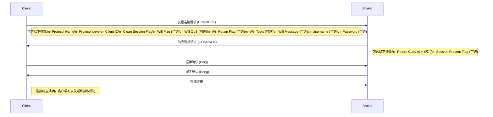
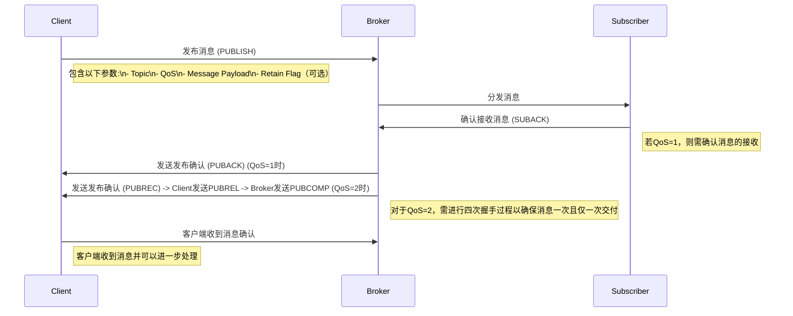
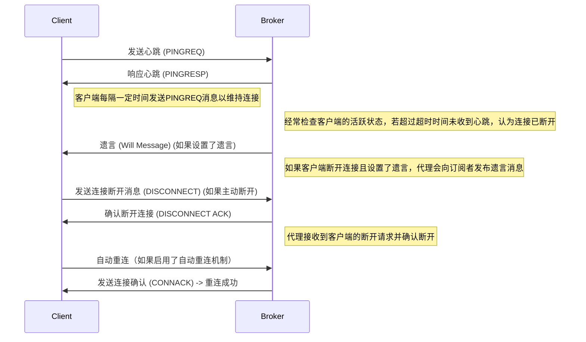

## 1. MQTT定义

MQTT（Message Queuing Telemetry Transport）是一种轻量级的、基于发布/订阅模式的消息协议。它非常适合需要低带宽、高延迟、不可靠网络的场景。MQTT最初由IBM公司提出，旨在为远程监控和控制应用提供一种简单且高效的消息传递机制。

MQTT的核心思想是**客户端-代理（Broker）架构**。客户端发布消息到主题，代理负责将这些消息转发给订阅该主题的客户端。由于其低带宽、低功耗、易实现的特点，MQTT在物联网（IoT）和移动应用中得到了广泛的应用。

## 2. MQTT的详细功能点

MQTT协议通过以下几个核心特性提供高效、可靠的消息传递：

### 2.1 发布/订阅模型

- **发布**：客户端向代理发送消息，消息包含一个主题（Topic）。这个消息将会被代理转发给所有订阅了该主题的客户端。
- **订阅**：客户端向代理注册感兴趣的主题，代理会根据这些订阅关系将消息推送给相关的客户端。

### 2.2 主题（Topic）

- 主题用于标识消息的内容类型，客户端可以通过订阅特定的主题来接收消息。
- 主题的层次结构是通过斜杠（/）分隔的字符串，可以动态选择订阅多个主题或通配符主题。

### 2.3 消息质量等级（QoS）

MQTT支持三个质量等级，用于控制消息传递的可靠性：

- **QoS 0**：最多一次传递，消息丢失不会重发。
- **QoS 1**：至少一次传递，保证消息至少传送一次，可能会重复。
- **QoS 2**：只有一次传递，保证消息不会丢失，也不会重复。

### 2.4 保留消息（Retained Messages）

代理会存储保留的消息，并在有新客户端订阅该主题时立即发送这些消息。保留消息非常适用于存储当前状态或初始化客户端的场景。

### 2.5 持久化会话（Persistent Session）

通过持久化会话，客户端在重新连接到代理时，可以恢复以前的订阅关系和消息状态。即使客户端离线，代理仍然会保存其订阅的消息。

### 2.6 心跳机制（Keep Alive）

心跳机制用于确保客户端和代理之间的连接保持活动状态。客户端必须定期向代理发送PING请求，代理会回应PONG。如果一定时间内没有接收到PING，代理会断开连接。

### 2.7 遗嘱消息（Last Will and Testament, LWT）

客户端在连接时可以指定一个“遗嘱”消息，如果客户端意外断开连接，代理会自动发布这个消息到指定的主题。这用于通知其他客户端某个客户端的断开或异常。

## 3. MQTT 3.1与MQTT 5的区别

MQTT 3.1和MQTT 5是该协议的两个版本，它们之间存在一些重要的差异，主要体现在以下几个方面：

### 3.1 协议版本

- **MQTT 3.1**：最初发布的版本，规范化了基本的发布/订阅模式，广泛应用于物联网设备和实时消息传递。
- **MQTT 5**：2018年发布，新增了一些增强功能，改善了协议的可扩展性、性能和错误处理机制。它更加灵活和强大，适用于更复杂的场景。

### 3.2 增强的错误处理

- **MQTT 3.1**：在出现协议错误时，客户端和代理会断开连接，但并未明确提供详细的错误信息。
- **MQTT 5**：提供了更细粒度的错误处理机制，客户端和代理能够交换更多的错误信息，错误码变得更加丰富和具体。这样客户端和代理能更容易地诊断和修复连接问题。

### 3.3 主题别名

- **MQTT 3.1**：没有主题别名的概念，每个消息都需要完整的主题路径。
- **MQTT 5**：引入了主题别名（Topic Alias）的概念，可以在消息中使用别名代替长主题路径，从而节省带宽和提高性能，特别是在需要频繁发送消息的应用中。

### 3.4 用户属性和消息属性

- **MQTT 3.1**：只支持消息本身的数据，无法在消息传输过程中附加额外的元数据。
- **MQTT 5**：引入了用户属性（User Properties）和消息属性（Message Properties），允许在发布的消息中携带附加信息，从而增强了协议的灵活性和可扩展性。

### 3.5 共享订阅

- **MQTT 3.1**：客户端只能单独订阅一个主题，无法共享该主题的订阅。
- **MQTT 5**：支持共享订阅，允许多个客户端共同订阅一个主题，并由代理轮流将消息发送给这些客户端，这对于负载均衡和提高系统的可扩展性非常重要。

### 3.6 会话信息

- **MQTT 3.1**：会话只能存储在客户端与代理之间的连接期间，客户端离线时无法恢复会话信息。
- **MQTT 5**：支持会话状态的持久化，包括消息的重发、持久化订阅等，客户端在重新连接时可以恢复所有状态，增强了断线重连时的体验。

### 3.7 增强的安全性

- **MQTT 3.1**：仅支持基本的用户名和密码身份验证。
- **MQTT 5**：增加了更多的认证和授权选项，例如通过自定义认证机制和更加灵活的访问控制策略来提高安全性。

### 3.8 连接超时机制

- **MQTT 3.1**：连接超时机制较为简单，客户端只能设置连接的最大等待时间。
- **MQTT 5**：引入了更加灵活的连接超时机制，允许客户端和代理协商更加精细的超时策略，以保证更高效的连接管理。

### 3.9 负载均衡

- **MQTT 3.1**：没有原生的负载均衡支持，多个客户端之间的消息转发主要依赖于代理的实现。
- **MQTT 5**：通过引入共享订阅和其他机制，更好地支持负载均衡，从而提高了系统的可扩展性和容错性。

## 4. 结论

MQTT作为一种高效、轻量的消息协议，特别适用于物联网和实时通信领域。随着版本的迭代，MQTT协议不断增强其功能和灵活性，MQTT 5相比于3.1版本，提供了更加丰富的特性和更强的扩展性，更加适应现代应用的需求。

对于开发者来说，理解这些差异能够帮助在不同场景下选择合适的协议版本，提升应用性能和可靠性。

# 5. 附泳道图：
## 1. MQTT连接过程

## 2. 消息的发布及接收过程

## 3. 连接的心跳检测和遗言机制

