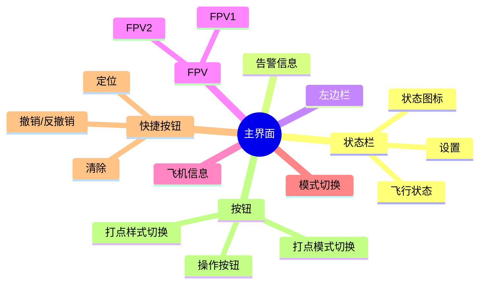

---
{"dg-publish":true,"permalink":"/工作/植保app主界面架构设计/","noteIcon":"","updated":"2023-11-29T16:47:32.285+08:00"}
---

# 预览图

# 思维导图

```mermaid
mindmap
	root((主界面))
		状态栏
			飞行状态
			设置
			状态图标
		告警信息
		左边栏
		FPV
			FPV1
			FPV2
		飞机信息
		模式切换
		快捷按钮
			撤销/反撤销
			定位
			清除
		按钮
			操作按钮
			打点模式切换
			打点样式切换
```
# 模式

- 全自主
- 果树
- AB点
- 大田
# 功能依赖拆分
