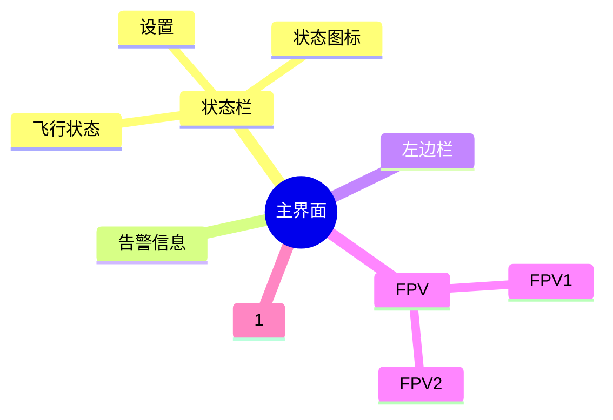

---
{"dg-publish":true,"permalink":"/工作/植保app主界面架构设计/","noteIcon":"","updated":"2023-11-29T16:04:50.327+08:00"}
---

```mermaid
mindmap
	root((主界面))
		状态栏
			飞行状态
			设置
			状态图标
		告警信息
		左边栏
		FPV
			FPV1
			FPV2
		1
```
